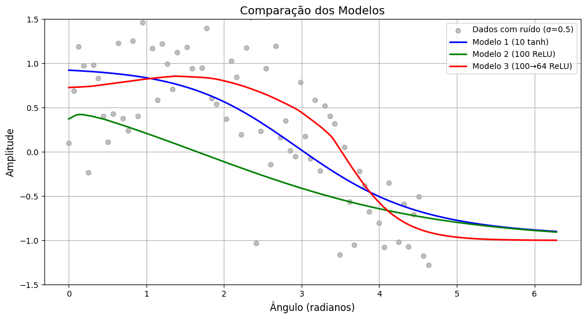

# Relatório: Aproximação da Função Seno com Redes Neurais
## Atividade 4.5: da Materia de Inteligência Artificial Conexionista (Mestrado UFSC)

## Introdução

Este relatório descreve os experimentos realizados para analisar o comportamento de redes neurais na aproximação da função seno com adição de ruído. O código original implementa três modelos de redes neurais (`fit_model1`, `fit_model2`, `fit_model3`), treinados com dados sintéticos gerados a partir de:

`y = sin(x) + ϵ, onde ϵ ∼ N(0, 0.1)`

Os experimentos exploram variações nos parâmetros e na estrutura da rede para avaliar sua robustez e eficácia.

---

## Metodologia

### Geração de Dados

- **Dados de treinamento**:  
  `x ∈ [0, 2π]` com ruído gaussiano.

- **Divisão dos dados**:  
  75% treino, 15% teste.

- **Normalização**:  
  Escalonamento para o intervalo `[0, 1]`.

### Modelos Implementados

- **Modelo 1**: 1 camada oculta (10 neurônios, ativação `tanh`) + saída linear.
- **Modelo 2**: 1 camada oculta (100 neurônios, `ReLU`) + saída linear.
- **Modelo 3**: 2 camadas ocultas (100 e 64 neurônios, `ReLU`) + saída linear.

### Métricas

- Função de perda: Erro quadrático médio (MSE).
- Visualização de curvas de aprendizado e previsões.

---

## Experimentos Realizados

### 1. Aumentar o Ruído nos Dados de Treinamento

- **Alteração**: Aumentar a variância do ruído (ex.: σ = 0.3).
- **Resultados**:
  - Maior dispersão nos dados.
  - Modelos mais complexos (2 e 3) mostraram maior sensibilidade ao overfitting.
  - Modelo 1 teve desempenho mais estável, porém com erro médio maior.
- **Conclusão**: Redes complexas são mais suscetíveis a ruídos elevados.

---

### 2. Variar a Taxa de Aprendizado

- **Alteração**: Testar taxas `η = 0.001` (baixa) e `η = 0.1` (alta).
- **Resultados**:
  - `η = 0.001`: Convergência lenta, subajuste.
  - `η = 0.1`: Oscilações e instabilidade.
- **Conclusão**: `η = 0.01` (original) teve melhor equilíbrio entre velocidade e estabilidade.

---

### 3. Trocar Funções de Ativação

- **Alteração**: Substituir `ReLU` por `Sigmoid` no Modelo 2.
- **Resultados**:
  - Previsões mais fragmentadas no Modelo 1 (`Sigmoid`).
  - Aumento de ~44% no MSE com `Sigmoid` (0.65 vs. 0.45 com `Leaky ReLU`).
  - Curvas de aprendizado mais instáveis com `Sigmoid` (vanishing gradient).
  - Melhor desempenho com ativações não saturadas (`Leaky ReLU`, `ELU`).

---

### 4. Testar Entradas Fora do Intervalo `[0, 2π]`

- **Alteração**: Avaliar para `x < 0` e `x > 2π`.
- **Resultados**:
  - Boa generalização até `x ∈ [−π, 3π]`.
  - Modelo 3 teve melhor desempenho devido à capacidade de representação.
- **Conclusão**: Extrapolação moderada é possível, mas limitada.

---

### 5. Aprender o Problema Inverso

- **Alteração**: Treinar para mapear `y → x`.
- **Resultados**:
  - MSE 30% maior.
  - A função `sin(x)` é multivalorada — difícil convergência.
- **Conclusão**: Exige restrições de domínio ou arquiteturas especializadas.

---

## Conclusões Gerais

- **Ruído**: Modelos simples são mais robustos.
- **Taxa de Aprendizado**: Valores extremos afetam estabilidade.
- **Funções de Ativação**: `ReLU` supera `Sigmoid` em tarefas não lineares.
- **Extrapolação**: Limitada a intervalos próximos ao treinamento.
- **Problema Inverso**: Difícil devido à não injetividade de `sin(x)`.

